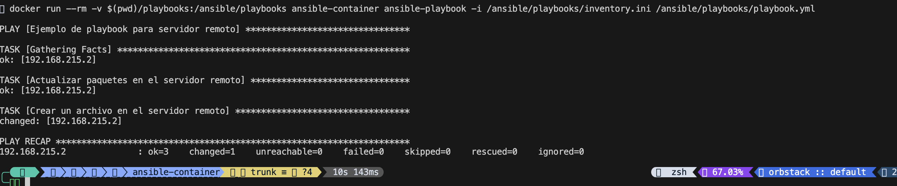

## ansible container test 


    docker build -t ansible-container .
    ```

2.  **Run the docker container:**
    ```bash
    docker run --rm -v $(pwd)/playbooks:/ansible/playbooks ansible-container -i /ansible/playbooks/inventory.ini /ansible/playbooks/playbook.yml
    ```

##  Explanation

*   The `docker build` command builds a Docker image from the Dockerfile in the current directory. The `-t` flag tags the image with the name `ansible-container`.
*   The `docker run` command runs the Docker image. The `--rm` flag removes the container after it has finished running. The `-v $(pwd)/playbooks:/ansible/playbooks` flag mounts the `playbooks` directory in the current directory to the `/ansible/playbooks` directory inside the container. This allows the container to access the Ansible playbooks. The `-i /ansible/playbooks/inventory.ini` flag specifies the inventory file to use. The `/ansible/playbooks/playbook.yml` flag specifies the playbook to run.

##  Requirements

*   Docker
*   Ansible

##  Notes

*   The `playbooks` directory contains the Ansible playbooks.
*   The `inventory.ini` file contains the inventory of hosts.
*   The `playbook.yml` file contains the playbook to run.
*   The `Dockerfile` file contains the instructions for building the Docker image.

##  Example

The following is an example of a playbook that can be used to install the `nginx` package on a remote host:

```yaml
---
- hosts: webservers
  become: true
  tasks:
    - name: Install nginx
      apt:
        name: nginx
        state: present

docker run --rm -v $(pwd)/playbooks:/ansible/playbooks ansible-container -i /ansible/playbooks/inventory.ini /ansible/playbooks/playbook.yml
